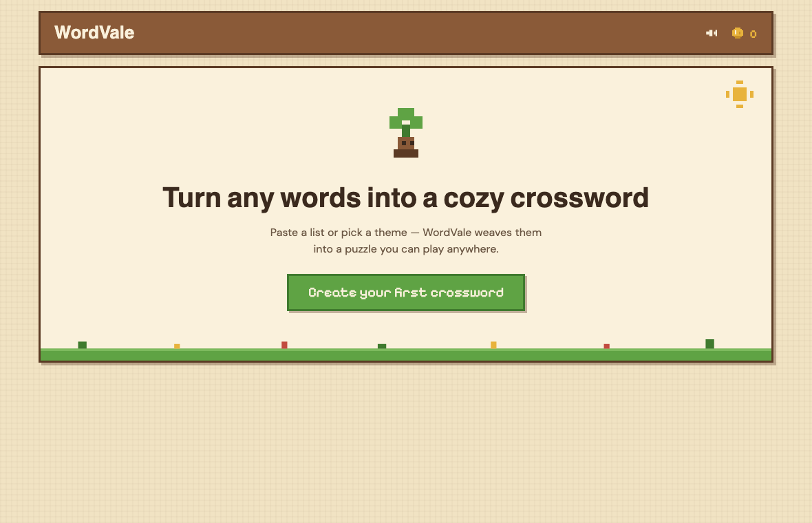
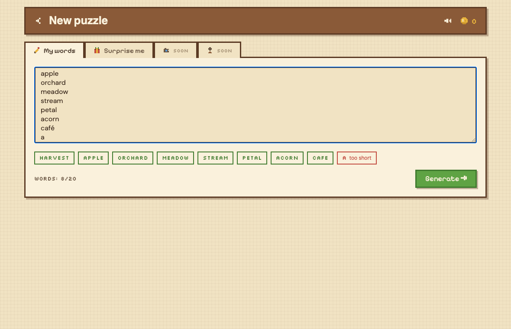
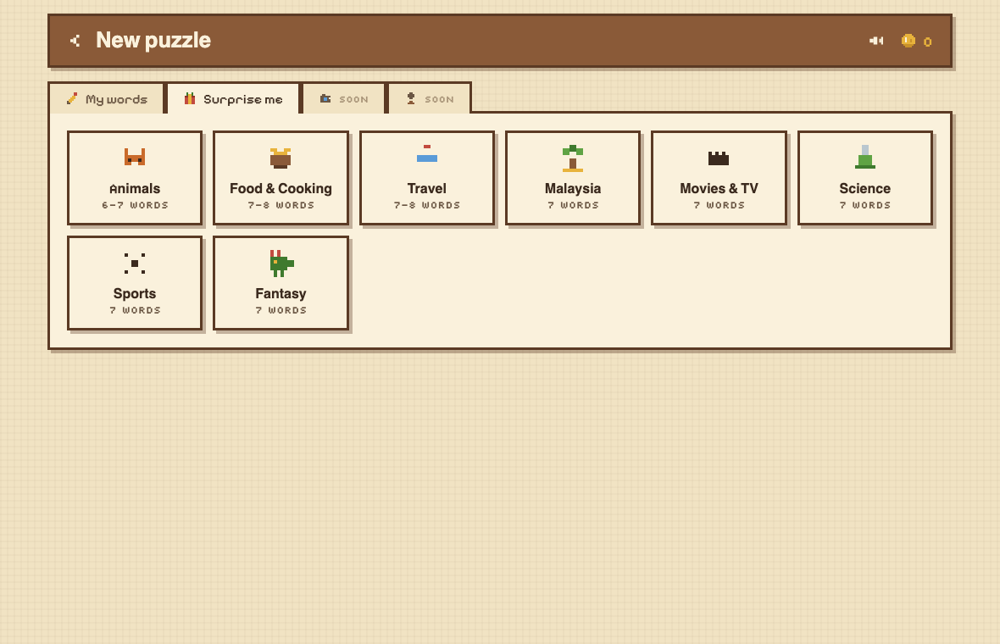
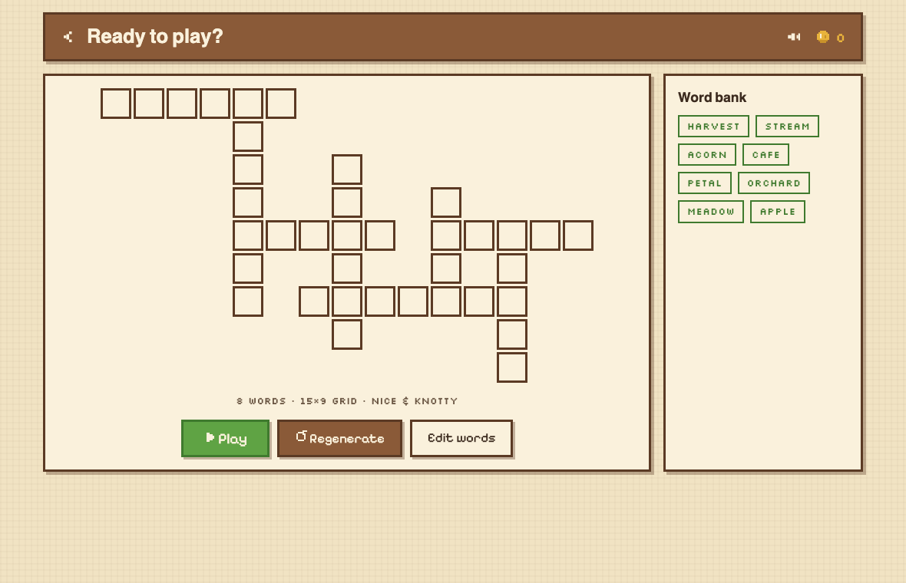
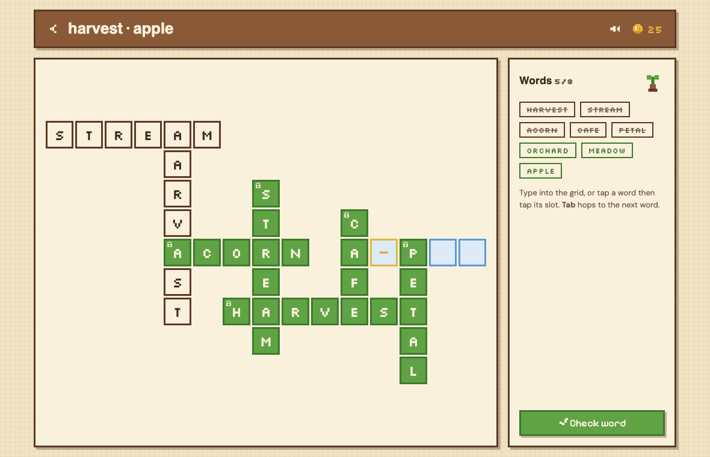
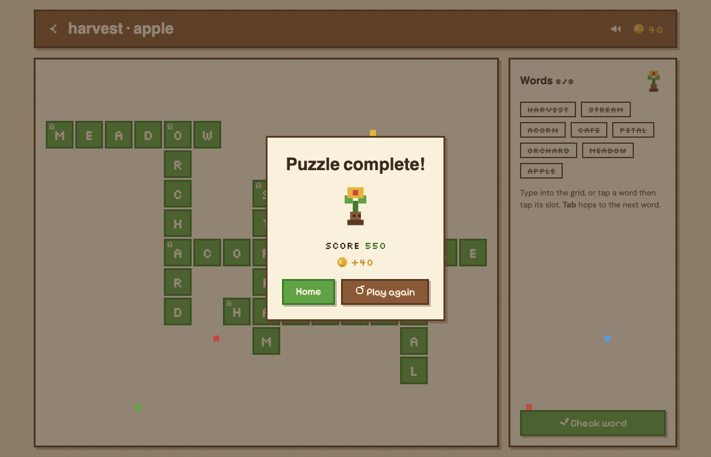

# 🌾 WordVale

**Turn any list of words into a cozy pixel-art crossword — and then play it.**

### ▶ [Play it now](https://wordvale-two.vercel.app) · no signup, works on your phone

Paste your vocabulary list, your grocery list, or the names of everyone at the party.
WordVale weaves the words into an interlocking puzzle, then hands it back to you to solve.
Everything runs in your browser: no accounts, no server, no data leaving your device.



---

## How it works

### 1. Give it some words

Type or paste them — one per line or separated by commas. WordVale checks each word as you
type and tells you plainly what it can't use, so nothing fails silently. Accents are handled
(`café` becomes `CAFE`), and anything too short, duplicated, or full of spaces gets flagged
before you press Generate.



**Or don't.** Pick one of eight built-in themes and get a puzzle instantly.



### 2. Check the shape before you commit

You see the puzzle before you play it. Don't like the layout? Regenerate for a completely
different one. Want to tweak your words? Go back and edit — your list is still there.



### 3. Play it

Two ways to fill the grid, whichever suits you:

- **Type it.** Click a slot and start typing. Letters advance on their own, `Tab` hops to the
  next word, arrow keys move around, `Backspace` walks back.
- **Place it.** Tap a word from the bank and the slots it can legally fit light up. Tap one.

Solve a word and it locks in green, coins fly to your pocket, and the little sprout beside
your progress grows. There's no drag-and-drop anywhere — it never feels good on the web.



### 4. Finish it



Your puzzles are saved automatically. Close the tab mid-word and pick up exactly where you
left off.

---

## What makes it interesting

**It tells you the truth when it can't help.** Some word lists genuinely cannot form a
crossword — `CAT, DOG, RABBIT, HORSE, SHEEP, GOAT` has no valid arrangement, and we can prove
it. Instead of a spinner or a shrug, WordVale says "we fit 5 of 6 — drop CAT and play?" and
lets you decide. Every failure mode has a designed, plain-English screen.

**No assets to download.** Every sound is synthesized at runtime with the Web Audio API — the
wood-block plucks as you type, the little arpeggio when a word solves, the fanfare at the end,
even the birds and breeze on the home screen. Every icon is a hand-built pixel SVG. There's not
a single image file or audio file in the bundle.

**It works offline.** Fonts are self-hosted, storage is local, generation happens in a Web
Worker on your machine. Load it once and it keeps working.

---

## Run it yourself

You'll need [Bun](https://bun.sh).

```bash
git clone https://github.com/faeezmnoor/wordvale.git
cd wordvale
bun install
bun run dev          # → http://localhost:5173
```

To try it on your phone, run `bun run dev --host` and open the **Network** URL it prints
(both devices on the same Wi-Fi).

| Command | What it does |
|---|---|
| `bun run dev` | Development server with hot reload |
| `bun run check` | Typecheck + lint + tests — green before every commit |
| `bun run test` | The test suite on its own |
| `bun run build` | Production build into `dist/` |

There's also a **generator playground** at `/?harness` in dev mode: type any word list, step
through seeds, and watch grids appear with their quality metrics. It's the fastest way to get
a feel for how the algorithm behaves.

---

## How it's built

React + TypeScript on Vite, no backend. Two pieces do the real work, and both are pure,
dependency-free, and unit-tested without a browser:

**[`src/engine/`](src/engine/) — the puzzle generator.** Given a list of words and a seed, it
returns an interlocking grid or an honest explanation. It sorts words by how connectable they
are, places them one at a time at their best-scoring crossing, backtracks when it paints itself
into a corner, and builds 32 candidate layouts before picking a winner. It's fully
deterministic: the same words and seed always produce the same puzzle, which is what makes
"regenerate" (just seed + 1) and the test suite possible. A property test throws 500 random
word lists at it and verifies every grid is legal, connected, and correctly normalized.

**[`src/ui/playMachine.ts`](src/ui/playMachine.ts) — the play logic.** Every interaction
(typing, tabbing, placing a word, checking an answer) is a pure reducer over one immutable
state object. The grid is the single source of truth for letters, so a crossing square can
never disagree with itself. All the fiddly rules live here and are tested directly: what happens
when you type over a solved letter, what `Backspace` does at the start of a word, which
direction a shared square belongs to on a second tap.

The rest is React screens (`src/ui/`), local storage (`src/state/`), and runtime audio
(`src/audio/`).

### The design system

The whole look is defined in **[DESIGN.md](DESIGN.md)** — an earthy palette with no pure black
or white, real pixel typefaces, hard offset shadows instead of blurs, and stepped `steps()`
animation so nothing ever eases smoothly (smooth tweening on pixel art looks wrong). If you
contribute UI, read that first.

### How this project was actually made

Unusually, the full development process is committed alongside the code in
**[`docs/`](docs/)**: the [workflow contract](docs/workflow.md), each iteration's
[plan](docs/iterations/01-core-loop/01-plan.md),
[design spec](docs/iterations/01-core-loop/02-design.md),
[technical spec](docs/iterations/01-core-loop/03-tech-spec.md),
[build log](docs/iterations/01-core-loop/04-build-log.md), and
[QA report](docs/iterations/01-core-loop/05-qa-report.md) — including every bug found in
review and what caused it. If you're curious how a small app gets planned, critiqued, and
shipped, it's all there.

---

## Contributing

Issues and pull requests are welcome. A few things worth knowing before you start:

- `bun run check` must be green. It runs the typechecker, the linter, and the tests.
- `src/engine/` stays pure — no React, no DOM, no `Math.random()`, no `Date.now()`. Randomness
  comes from a seeded generator that's passed in. This is what keeps puzzles reproducible.
- Emoji aren't used in the interface. Icons are hand-built pixel SVGs in
  [`src/ui/components/Sprites.tsx`](src/ui/components/Sprites.tsx) — copy the pattern.
- New gameplay constants belong in [`src/state/economy.ts`](src/state/economy.ts) or
  [`src/engine/config.ts`](src/engine/config.ts), not scattered inline.

**[ROADMAP.md](ROADMAP.md)** is the place to look for what's next: it groups every idea we
considered — harder puzzle modes, a coin economy, growing plants where you solve, shareable
puzzle links — with notes on where each one would live in the code and what would make it
done. It's also honest about what was planned for v1 and never built.

## License

[MIT](LICENSE) — do what you like with it.
